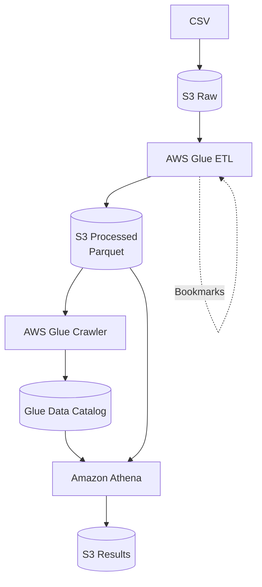

# Data Platform

AWS data platform built with AWS CDK to process educational data using S3, AWS Glue, and Amazon Athena.

The platform ingests CSV data, transforms it into partitioned Parquet files, catalogs the data with AWS Glue, and enables SQL analytics through Athena.

## Architecture



## Stack

* AWS CDK
* TypeScript
* Python
* Amazon S3
* AWS Glue
* AWS Glue Data Catalog
* Amazon Athena
* Apache Spark
* Parquet

## Project Structure

```text
data-platform/
├── bin/
│   └── data-platform.ts
├── lib/
│   └── data-platform-stack.ts
├── glue/
│   └── transform.py
├── data/
│   ├── academic_data.csv
│   └── README.md
├── queries/
│   ├── 01_average_grade_by_course.sql
│   ├── 02_low_attendance_by_course.sql
│   ├── 03_average_grade_by_year.sql
│   ├── 04_partition_query.sql
│   ├── 05_partition_records.sql
│   └── README.md
├── cdk.json
├── package.json
└── README.md
```

## Data Pipeline

The Glue ETL job:

1. Reads the CSV file from S3.
2. Converts numeric columns to the appropriate types.
3. Validates `year` and `month`.
4. Writes Snappy-compressed Parquet.
5. Partitions the data by `year/month`.
6. Uses Glue Job Bookmarks to avoid reprocessing input data.

Example output:

```text
academic_data/
├── year=2023/
│   ├── month=1/
│   └── ...
├── year=2024/
│   ├── month=1/
│   └── ...
└── year=2025/
    ├── month=1/
    └── ...
```

## Glue Data Catalog

Database:

```text
academic_data_catalog
```

Table:

```text
academic_data
```

Schema:

```text
student_id   string
course       string
grade        double
attendance   double
```

Partitions:

```text
year    string
month   string
```

## Athena Queries

Five SQL queries are included in the `queries/` directory:

* Average grade by course
* Low attendance records by course
* Average grade by year
* Average grade using partition pruning
* Records in a specific partition

Example:

```sql
SELECT
    year,
    month,
    course,
    ROUND(AVG(grade), 2) AS average_grade
FROM academic_data
WHERE year = '2025'
  AND month = '7'
GROUP BY year, month, course
ORDER BY average_grade DESC;
```

All five queries were successfully validated in Athena.

## Validation

The platform was tested with **500 synthetic academic records**.

### Average Grade by Course

| Course                   | Average |
| ------------------------ | ------: |
| Ingeniería de Software   |    3.19 |
| Cálculo II               |    3.17 |
| Física General           |    3.16 |
| Programación Interactiva |    3.10 |
| Cálculo I                |    3.04 |

### Average Grade by Year

| Year | Average |
| ---- | ------: |
| 2023 |    3.02 |
| 2024 |    3.02 |
| 2025 |    3.01 |

Partitioned Parquet output was successfully generated using `year/month`, and Athena queries using partition filters were validated successfully.

## Boss Fight

The platform was extended to support larger workloads through:

* `year/month` S3 partitioning
* Glue Job Bookmarks
* Configurable Glue workers
* Parquet columnar storage
* Athena partition pruning

The test configuration uses:

```text
Glue Version: 4.0
Worker Type: G.1X
Workers: 2
```

Partitioning reduces the amount of data scanned by Athena for queries that filter by `year` and `month`, helping reduce query costs as the dataset grows.

## Deployment

Install dependencies:

```bash
npm install
```

Bootstrap CDK if required:

```bash
cdk bootstrap
```

Deploy:

```bash
cdk deploy
```

Upload the sample data to the raw bucket:

```bash
aws s3 cp data/academic_data.csv s3://<raw-bucket>/
```

Run the Glue Job:

```bash
aws glue start-job-run \
  --job-name academic-data-transform \
  --region us-east-1
```

Run the crawler after the ETL job completes:

```bash
aws glue start-crawler \
  --name academic-data-crawler \
  --region us-east-1
```

## Cleanup

Remove all resources created by CDK:

```bash
cdk destroy
```
